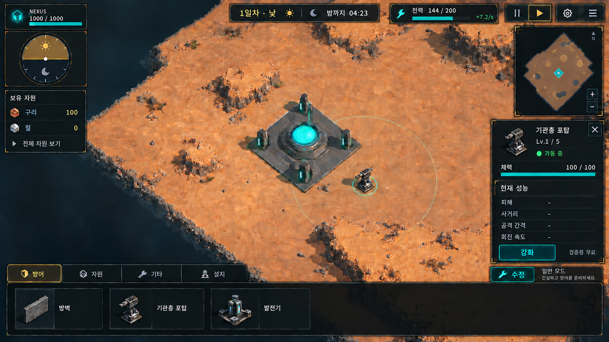
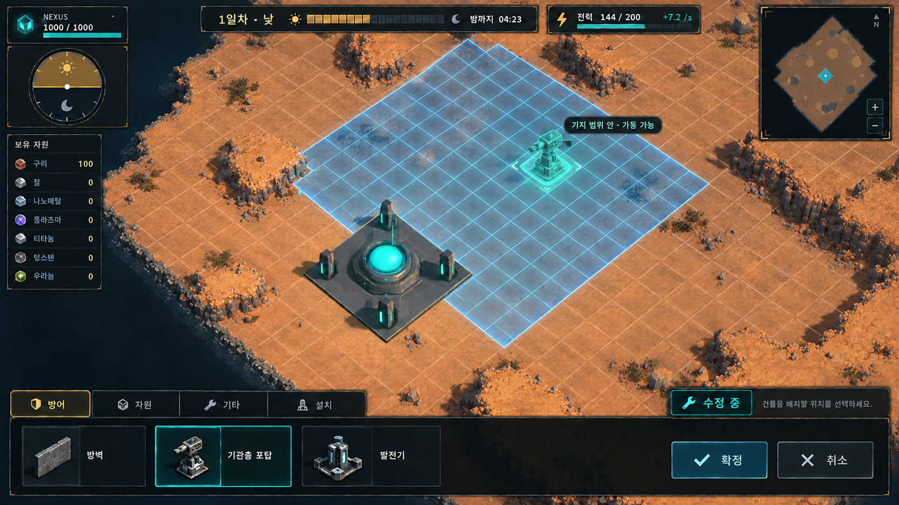

# BELTFED 참고 UI 시안

2026-09-27 작성한 **시각 시안**이다. 현재안은 미니맵을 우측 상단에 둔 뒤, 일반 상태에서 포탑을 선택한 강화 패널까지 보여준다. [선택 전 화면](BELTFED_UI_시안_v2.png)과 [첫 시안](BELTFED_UI_시안.png)은 비교용으로 보존한다. 게임 UI 구현이나 확정 사양은 아니다. 화면의 자원·전력·시간·체력 수치는 구성 예시이며 콘텐츠 설정값을 뜻하지 않는다.

## 확인한 레퍼런스

[BELTFED 공식 Steam 스크린샷](https://shared.fastly.steamstatic.com/store_item_assets/steam/apps/4879420/b6a76c9b52d856efc98a3332a8ae56bbae8a587f/ss_b6a76c9b52d856efc98a3332a8ae56bbae8a587f.1920x1080.jpg?t=1789968873)에서 상단의 날짜·경고·전력·시간 조작, 좌측 자원 목록, 하단의 범주별 건설 바와 넓은 중앙 월드 화면을 확인했다. 배치 원리를 참고했고 이미지·아이콘·패널 형태는 복제하지 않았다.

## Eternal Steam에 맞춘 구성

- 상단 왼쪽: 메인 넥서스 체력과 기존 반원형 낮/밤 시계. 상단에는 진행 막대를 반복하지 않는다.
- 상단 중앙: 일차·낮/밤·전환까지 남은 시간. 옆에 기지 전력과 수급 속도.
- 왼쪽: 주요 보유 자원만 보이는 좁은 목록과 전체 보기. 항목이 늘어나도 월드 중앙을 덮지 않는 폭을 목표로 한다.
- 하단: 현재 카탈로그의 방어·자원·기타·설치 분류와 건물 목록. 배치 수정 진입 버튼을 가까이 둔다.
- 오른쪽 위: 시간 조작 바로 아래의 미니맵. 하단 건설 바와 겹치지 않게 둔다.
- 미니맵 아래: 건물 선택 중에만 보이는 상세·강화 패널. 실제 건물에서 읽은 현재/최대 레벨, 체력, 가동 여부, 해당 모듈의 성능을 표시한다. 시안의 `-`는 데이터가 없어서 그린 자리 표시이며 실제 UI에서는 지원하지 않는 항목을 숨긴다. 강화 버튼은 현재 `검증용 무료` 정책을 명시한다.
- 개발자 소환·날짜 강제 전환·검증 통계는 실제 플레이 HUD와 분리해 접이식 개발자 패널에 둔다.

첫 이미지는 **일반 낮 준비 중 포탑을 선택한 상태**를 표현한다. 선택을 해제하면 상세 패널도 닫힌다. 실제 UI에서는 편집 중, 최대 레벨, 메인 기지 레벨 제한, 패배/복원 차단에 따라 강화 버튼을 비활성화하고 이유를 표시해야 한다. 수정 중 회수 예정 표시, 야간 공세 경고, 패배/저장 화면은 후속 상태 시안이 필요하다. 현행 접기 기능과 입력 차단 규칙은 유지 대상으로 본다. 건설 비용은 확정 기획이 없어 시안에 넣지 않았다. BELTFED의 컨베이어·탄약·드론·카드 시스템을 도입한다는 뜻도 아니다.

## 수정·설치 상태

두 번째 이미지는 수정 상태의 **시각 제안**이다. 현재 월드 격자는 얇고 중립적인 선으로 남기고, 기지의 가동 영역만 옅은 푸른색 셀 홀로그램과 밝은 외곽선으로 구분한다. 배치 중인 건물의 점유 칸은 더 밝게 표시한다. 수정 중에만 보이고, 확정·취소 후에는 숨긴다.

현재 메인 기지 영역은 [확정된 정면 가장자리부터 앞쪽 11×11칸](../고정_메인기지_플레이루프_적용결과.md)을 기준으로 한다. 시안 이미지는 투시가 들어간 **개념 그림**이므로 정확히 121칸을 검증하는 자료가 아니다. 실제 구현 시 홀로그램 외곽과 셀 채움은 건설/가동 판정에 쓰이는 동일한 `IBuildAreaGeometry` 결과에서 만들어야 한다. 지형상 설치 불가능한 칸은 파란색으로 칠하더라도 설치 가능한 것으로 오해되지 않게 별도 차단 표시가 필요하다.

현재 규칙에서는 유효 지면이면 기지 밖에도 설치할 수 있지만, 범위 밖 건물은 비작동이다. 따라서 푸른 영역은 **설치 가능 여부 전체가 아니라 기지 범위 안의 가동 가능 영역**을 뜻한다. 범위 밖 배치 미리보기에는 `설치 가능 · 비작동`을 표시하고, 지형/점유 충돌은 `설치 불가`로 구분한다. 범위가 겹치면 셀을 중복해서 밝히지 않고, 어느 기지 소속인지 선택 정보에서 확인할 수 있어야 한다.

향후 확장 크기나 성장 방식은 이 시안으로 확정하지 않는다. 메인 고정 영역, 서브 기지의 기존 레벨 영역, 특수 영역 제공자를 각각 데이터에서 읽어 합친 결과만 그리면 나중에 수치·규칙이 바뀌어도 UI 배치 로직을 다시 짤 필요가 없다. 넓은 월드 전체를 셀별 GameObject로 생성하지 않고 현재 카메라 주변 청크와 보이는 영역만 메시로 그리는 방향을 유지한다.

## 개선 제안

1. 낮/밤 진행률은 기존 시계 하나로 표현하고 상단에는 날짜와 남은 시간만 남겨 정보 중복을 줄인다.
2. 자원은 현재 플레이 판단에 필요한 항목부터 보이게 하고 전체 목록을 펼칠 수 있게 한다. 어떤 자원을 기본 표시할지는 콘텐츠 기획과 함께 결정한다.
3. 시간 조작은 현재 기능에 맞는 정지/재개만 제공한다. 시안의 두 버튼은 상태별 표현 예시이며, 실제 구현에서는 단일 전환 버튼이 적합하다. 배속 기능은 구현 전까지 노출하지 않는다.
4. 강화 패널의 성능은 건물 모듈이 제공하는 값만 표시한다. 강화 전후 변화량은 실제 수치가 연결된 경우에만 보여주고, 비용표가 정해지면 `검증용 무료`를 실제 비용과 부족 사유로 교체한다.
5. 전력 부족·비작동·강화 불가 사유는 색상만으로 알리지 말고 짧은 문장으로 표시한다.
