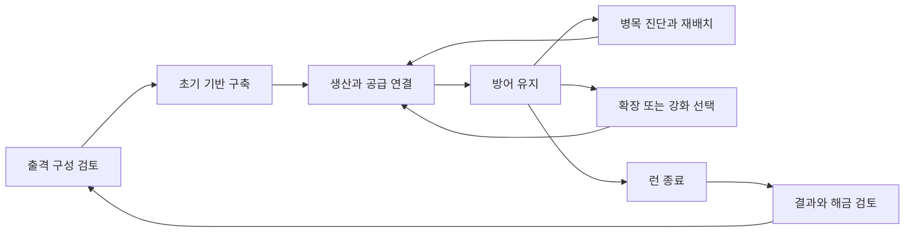

# BELTFED 상세 역기획서

문서 버전 **0.2.0** · 조사 기준 **2026-09-29 KST** · 대상 **BELTFED - Roguelike Factory Defense / Steam App 4879420**

공식 공개 정보와 영상·스크린샷을 대조한 역기획 확장판이다. 직접 플레이한 빌드가 없으므로 원작의 완전한 사양 복원본은 아니다. 시스템 구조, 플레이어 의사결정, 경제 분석 모델, 화면 관찰, 추가 검증 절차를 함께 기록한다. 미확정 값은 비워 두며 추정을 원작의 수치로 승격하지 않는다.

- [공개자료 목록·영상 시간코드·콘텐츠 및 수치 부록](BELTFED_공개자료_영상분석.md)
- [출처·관찰·미확정 항목 관리대장](BELTFED_검증대장.md)
- [변경 이력·유지 절차](BELTFED_유지관리.md)
- [기존 레퍼런스 등록](BELTFED.md)
- [Eternal Steam 현재 상태](../README.md)

## 1. 읽는 기준과 조사 범위

| 표기 | 의미 | 사용 범위 |
|---|---|---|
| F | 개발사 공개 설명에 명시 | 공개 당시 설명이 존재한다는 사실. 출시 빌드 동작 보증은 아님 |
| O | 공식 스크린샷·영상 표본에서 직접 관찰 | 해당 장면의 표시·배치만 확인. 입력 결과와 지속 규칙은 미확인 |
| A | 분석자의 설계 해석·분석 모델 | 재미 구조와 검증 가설. 원작 사양이나 구현 방식으로 인용 금지 |
| U | 미확인 | 플레이·추가 공식 자료로 확인하기 전까지 값과 규칙을 확정하지 않음 |
| E | Eternal Steam 검토 제안 | 도입 검토용. 구현 지시·확정 기획과 구분 |

F는 아래 2절의 사실 카드에 모았다. 상세 절은 **F 공개 설명·O 장면 관찰·A 분석·U 미확인**을 구분한다. 출처 ID와 관찰 ID의 상세는 검증대장을 따른다. 개발자 마케팅 문구의 적 규모를 실측 동시 활성 수·프레임 성능으로 바꾸지 않는다.

이번 판은 공식 Steam 설명, 공식 사이트·프레스킷, 개발자 FAQ, Steam 공지 2건, 공식 영상 5종의 목록과 확인 가능한 장면, 스크린샷 16개 파일, 외부 소개 영상의 자막 및 발표 기사 탐색을 반영했다. 주요 상세 근거는 9분 게임플레이 공개 영상과 6분 B-roll이다. 영상 전체 연속 시청이나 모든 인터넷 자료의 완전 수집은 아니다. 접근·관찰 범위는 [자료 부록 1절](BELTFED_공개자료_영상분석.md)에 명시했다.

**현재 가장 중요한 발견:** 생산·보급뿐 아니라 철도·터널·텔레포터까지 포함하는 물류 확장, 파괴·작업 드론·접촉 방어를 바꾸는 카드, 공세 방향·구성 예고, 일시정지 중 운영, 전력 고갈 경고가 확인된다. 따라서 이 게임의 역기획은 ‘많은 적을 포탑으로 막는 게임’에 머물지 않고 **미리 받은 위험 정보에 맞춰 공장을 구성하고, 공급·전력·방어의 연쇄 손실을 복구하는 운영 게임**으로 읽어야 한다(A).
## 2. 공식 사실 카드

다음은 [공식 Steam 설명 S1](https://store.steampowered.com/app/4879420/BELTFED/)의 간략 요약이다.

| ID | 확인된 내용 |
|---|---|
| F01 | Steam은 Hello World Studios 개발·배급, 싱글플레이, 2027년 출시 예정으로 표기. 프레스킷은 배급 미정·2027년 봄 목표로 병기 |
| F02 | 광석·컨베이어·제련·조립·탄약 생산과 전력 관리 결합 |
| F03 | 총기·화염·로켓·박격포·레이저·드론·지뢰 계열 방어 수단 소개 |
| F04 | 넥서스는 중앙 지능·아이템 저장소이며 함락 시 런 종료 |
| F05 | 안개 너머 자원 확보와 기지 확장 |
| F06 | 런 중 강화 카드. 건물 폭발·블랙홀 포격을 변화 예시로 제시 |
| F07 | 무기·건물·카드·넥서스 코어·모듈 해금 및 출격 전 구성 선택 |
| F08 | 한 런 안에서 자동화 성장 경험. 행성마다 규칙·위험 차이 |
| F09 | 대규모 군집과 런 누적 대량 처치를 강조. 성능 실측 자료는 미확보 |

추가 공식 근거는 [개발자 FAQ S8](https://steamcommunity.com/app/4879420/discussions/0/562542339336370616/), [최신 개발 소식 S10](https://store.steampowered.com/news/app/4879420?emclan=103582791475819637&emgid=713413492630095714), [프레스킷 S7](https://helloworldstudios.io/press/)이다.

| ID | 공식 설명 | 상태·제약 |
|---|---|---|
| F10 | 모든 행동을 일시정지 중 수행 가능, brutal 모드는 일시정지 불가 | FAQ의 조작 규칙. 배속별 상세 동작은 미검증 |
| F11 | 데모는 로그라이크·샌드박스, 정식판은 캠페인 추가 목표 | 제공 계획. 현재 이용 가능한 모드 목록과 구분 |
| F12 | 2027년 1.0 지향, 얼리액세스 계획 없음; 데모 일정 미발표 | FAQ 게시·수정 시점의 계획 |
| F13 | Unity DOTS 사용 | 구체적 ECS 구성·길찾기·GPU 처리·성능 수치 미공개 |
| F14 | 큰 전력 부담으로 적 원거리 공격을 막는 대형 보호막 소개 | 최신 개발 소식. 반경·비용·상세 조건 미확인 |
| F15 | 개선된 튜토리얼, 선택형 조언 창 소개 | 상세 튜토리얼 플로우 실기 미검증 |
| F16 | 미니맵을 다음 플레이테스트에서 시험할 계획 | 현재 모든 빌드 제공 확정 아님 |
| F17 | 싱글플레이 우선; 멀티는 탐색 단계, 모딩 지원은 출시 시 가능성 낮음 | 영구적인 미지원 선언으로 해석하지 않음 |

[발표 기사 S4](https://www.capsulecomputers.com.au/2026/09/automate-annihilation-roguelike-factory-defense-title-beltfed-announced-playable-steam-demo-coming-soon/)의 연내 데모 예정 보도와 FAQ의 일정 미발표를 함께 남긴다. 조사 과정에서 실제 데모 설치·실행은 하지 않았다. 최신 공지의 위시리스트 10만·트레일러 조회 100만 이상은 개발사 자체 발표 지표이며 판매량·플레이어 수·재미 검증 수치가 아니다.

## 3. 핵심 경험과 설계 의도 — A

**핵심 가설: 생산 시설의 배치와 가동을 유지하는 행위 자체가 전투력을 만드는 게임이다.** 포탑을 추가하는 선택은 그것을 계속 쏘게 할 자원·가공·운송·전력의 비용과 함께 평가해야 한다.

| 경험 축 | 플레이어의 질문 | 재미가 생기는 조건 | 무너질 수 있는 조건 |
|---|---|---|---|
| 생산의 전투화 | 더 지을 것인가, 기존 무기를 계속 쏘게 할 것인가? | 증설 결과가 전선에서 보임 | 생산량과 전투 결과의 연결이 숨겨짐 |
| 위기 속 운영 | 지금 고칠 병목은 어디인가? | 원인을 보고 한두 행동으로 회복 가능 | 다수 경고가 동시에 떠 우선순위를 잃음 |
| 확장의 대가 | 새 자원이 늘어난 방어 부담을 감당하는가? | 확장 전후 이득과 비용이 비교됨 | 넓히는 것이 항상 정답이거나 항상 손해 |
| 런별 조합 | 이번 강화에 맞춰 무엇을 바꿀 것인가? | 기존 배치와 다른 선택이 가능 | 강화가 단순 배율에만 머묾 |
| 반복 학습 | 이번 실패에서 무엇을 다음에 바꿀 것인가? | 패배 원인이 식별됨 | 영구 해금만 기다리는 반복이 됨 |

기획적으로 중요한 구분은 보유량과 처리량이다. 저장소의 자원이 충분해도 전선에 필요한 속도로 도달하지 않으면 방어가 멈출 수 있다. 이 가설은 물류 규칙의 실측으로 확인해야 한다(U02, U03).

## 4. 플레이 루프와 상태 전이 — A / O / F

아래는 분석용 논리 순서다. 실제 메뉴 순서, 화면 이름, 웨이브 시작 버튼의 존재를 뜻하지 않는다.

| 시간 범위 | 반복 행동 | 판단 정보 | 남겨야 할 관찰 |
|---|---|---|---|
| 전투 순간 | 공격 방향 확인, 고장·부족 대응 | 넥서스 위험, 정지 시설, 전선의 빈틈 | 최초 이상 표시와 대응 시점 |
| 운영 구간 | 생산·운송·방어 용량 조절 | 공급률, 소비률, 비축량, 전력 여유 | 증설 전후 실제 가동률 |
| 런 전체 | 확장·강화 조합 구성 | 자원 접근성, 획득 선택지, 생존 가능성 | 선택하지 않은 대안과 이유 |
| 여러 런 | 실패 원인 학습, 구성 변경 | 결과·해금 정보 | 동일 조건에서 재도전 결과 |

### 4.1 화면으로 보강한 시간 구조 — O / F

V02 약 6:26의 Day 7·Survive 0:00과 약 7:20의 Day 8·Swarm incoming 7:01은 공세 생존 표시와 다음 공세 예고 표시가 구분됨을 보여준다(O07). P08은 다음 공세 방향·총량·적 구성을 미리 알리는 창이다(O08). 다만 편집된 영상의 시점 차이로 하루 길이·공세 주기·전환 조건을 산출하지 않는다. 다음 공세 예고 중에도 적·효과가 보여 ‘준비 시간=전장에 적 없음’으로 정의할 수 없다.

F10에 따라 일반 운영은 일시정지로 판단 시간을 확보할 수 있다. A: 기본 경험의 부담은 순수 클릭 속도보다 진단과 배치에 가깝고, brutal 모드는 같은 운영 문제에 시간 압박을 더한다. 실제 난이도별 자원·적 보정은 별도 U다.

### 4.2 관찰을 바탕으로 재구성한 한 런의 운영 흐름 — A

1. **시작 기반:** 넥서스 주변의 드러난 공간에서 Salvager 등 초기 획득 시설과 벨트를 연결한다. V03 초기 장면을 근거로 한 예시이며 유일한 시작 정답은 아니다.
2. **첫 공급 회로:** 중간재·탄약 생산과 무기 설치를 함께 확보한다. HMG는 설치 재료와 사격용 MG Ammo가 구분된다.
3. **공세 대비:** 예고 방향과 적 구성을 읽고 전력 여유, 보급, 외곽 방어를 조정한다. 예고가 실제로 언제 갱신되는지는 미확인이다.
4. **교전 중 운영:** 건설 미리보기·작업 광선이 전투와 함께 보인다. 건설·보수·생산 증설을 전투 결과와 연결한다.
5. **성장과 재편:** 상위 산업·물류·방어 목록과 카드가 선택 폭을 늘린다. 모든 목록이 한 런에서 자동 해금된다는 뜻은 아니다.
6. **위기 진단:** 전력 경고→시설 중단 위험→넥서스 침해를 구분한다. 영상 후반의 동시 발생만으로 정전이 침투의 유일한 원인이라고 단정하지 않는다.

**U:** 성공 종료 조건, 목표 생존 시간, 행성 이동의 런 경계, 중도 포기 보상, 저장·이어하기는 미확인이다. 넥서스 패배 조건만으로 무한 생존 또는 특정 보스 클리어를 단정하지 않는다.

## 5. 생산·자원 경제 — A

### 5.1 분석용 생산 그래프

F02를 기준으로 조사할 연결은 `원재료 → 중간재 → 전투 소모품 → 방어`다. 모든 품목이 이 순서를 거친다는 뜻은 아니다. 정확한 레시피와 투입 수량은 U01로 관리한다.

| 조사 대상 | 입력으로 확인할 것 | 출력으로 확인할 것 | 병목 판별 방법 |
|---|---|---|---|
| 자원 획득 | 자원 위치·채취 조건·전력 | 실제 초당 산출량 | 수요 증가 후 원료 대기 비율 |
| 가공 시설 | 원료 종류·투입률 | 중간재·가공 시간 | 입력 충분/출력 정체를 분리 |
| 조립 시설 | 복수 입력의 동시 필요 여부 | 소모품 생산량 | 특정 재료 하나가 전체를 막는지 |
| 운송 구간 | 입출력 방향·연결 조건 | 도착량·지연 | 앞단 적체와 뒷단 고갈의 동시 발생 |
| 저장 구간 | 용량·접근 조건 | 출고 속도·보호 기능 | 재고가 있는데도 시설이 멈추는지 |
| 방어 소비 | 발사당 비용·가동 조건 | 실제 발사·피해 | 탄약 부족과 전력 부족을 분리 |

### 5.2 스크린샷에서 읽은 품목 — O01

[공식 화면 S2](https://shared.fastly.steamstatic.com/store_item_assets/steam/apps/4879420/b6a76c9b52d856efc98a3332a8ae56bbae8a587f/ss_b6a76c9b52d856efc98a3332a8ae56bbae8a587f.1920x1080.jpg?t=1789968873)의 좌측 목록에서 다음 이름을 판독했다. 역할 분류는 이름에 근거한 **A 가설**이며 생산 관계는 미확정이다.

| 화면 표기 | 조사용 역할 가설 | 확정하지 않을 내용 |
|---|---|---|
| Iron Plate / Copper Plate | 금속 중간재 | 해당 금속 광석과의 교환비 |
| Copper Wire / Reinforced Plate | 가공 부품 | 상위 레시피와 테크 단계 |
| Wood / Coal | 원료·연료 후보 | 발전에 반드시 소모되는지 |
| MG Ammo / Sniper Ammo | 무기별 탄약 후보 | 한 발당 소비량·공유 여부 |
| Flame Fuel / Explosives | 화염·폭발 계열 소모품 후보 | 정확한 대응 무기·제조 시설 |
| Advanced Core / Advanced Coil | 고급 부품 후보 | 희귀도·해금·레이저와의 관계 |
| Hydrogen Canister | 저장된 물질·연료 후보 | 수소 발전·화염·제조 사용처 |
| Worker Drones | 작업 유닛 또는 수량 정보 후보 | 전투 드론과 동일한지·건설 방식 |

이 화면은 MG Ammo가 0으로 표시되는 시점을 포함한다. 이것만으로 전선 전체 정지, 총기 종류별 탄창, 전역 재고 정책을 입증할 수 없다. 표시값은 가격·초기 지급량·최대치로 전사하지 않는다.

### 5.3 확인된 생산 시설과 수치 — O09 / O10

V02·V03의 Industry 메뉴에는 잔해 회수·벌목·채굴, 제련·조립, 전기 제련·고급 조립, 수소·합금·탄피 재활용·산업 증폭 관련 시설이 노출된다. 전체 이름은 [콘텐츠 부록 6절](BELTFED_공개자료_영상분석.md)에 보관한다. 이름만으로 레시피 연결을 확정하지 않는다.

V03 약 1:07의 Salvager 상세는 Iron Plate, 효율 100%, 45/min, 0.75/s, 채취 중 18/s, 품목당 24를 표시한다. `45÷60=0.75`, `18÷0.75=24`의 관계가 맞아 생산률과 단위 생산 비용을 함께 보여주는 UI로 해석할 수 있다(A). 수치는 개발 빌드의 그 장면 표시값이며 강화 없는 기본값이나 플레이 실측이 아니다.

자원 잔량 997/997 표시로 **잔량을 갖는 채취 대상이 존재함**은 확인된다. 모든 광물의 고갈 정책·시작 잔량은 모른다. 반대로 V02 약 8:15의 물은 Infinite라고 표시된다. 따라서 모든 자원을 유한·무한 중 하나로 통일한 경제 모델은 부적절하다.

P14의 Spent Shell과 메뉴의 Shell Recycler는 재활용 순환을 조사할 근거다. 회수율·수거 자동화·투입 재료는 아직 없다. 이를 ‘탄약 무한 순환’으로 서술하지 않는다.

### 5.4 병목 의사결정 — A

1. 방어가 약해졌다면 우선 포탑의 실제 가동 상태를 본다.
2. 공급이 부족하다면 생산 부족인지, 이동 지연인지, 연결 누락인지 분리한다.
3. 생산 부족이면 입력 원료·가공 용량·전력 조건을 역순으로 추적한다.
4. 정상 가동 중에도 밀리면 무기 구성·집중 화력·방어 위치를 검토한다.
5. 조치 뒤에는 생산량뿐 아니라 전선에 도착하는 양과 방어 유지 시간을 비교한다.

이 순서를 UI가 지원하면 실패가 학습으로 이어진다. 포탑 추가만 반복하게 만드는 UI라면 생산 디펜스의 선택이 전달되지 않을 수 있다.

## 6. 컨베이어·공간 설계 — A

O02·O09에서 벨트, 분기기, 교차용 Bridge, 철로·열차, Tunnel, Smart Splitter, Conveyor Teleporter 메뉴를 확인했다. P10에는 실제 열차 형태 유닛도 보인다. 분배 비율·필터·우선순위·열차 적재·텔레포터 연결 조건·처리량은 U02·U19다.

배치 미리보기의 방향 화살표와 실제 물품이 놓인 벨트는 물류 연결을 시각화한다. A: 초반에는 짧은 공급 회로, 후반에는 교차·장거리·선별 문제를 해결하는 선택지가 늘어나는 구조로 읽힌다. 정확한 테크 선후 관계는 메뉴 순서만으로 정하지 않는다.

| 선택 | 기대 이득 | 비용·위험 가설 | 검증 질문 |
|---|---|---|---|
| 중앙 생산 집중 | 시설 공유, 관리 단순화 | 긴 보급선·단일 병목 | 한 연결 손실이 몇 무기에 전파되는가? |
| 전선별 분산 생산 | 공급 독립성·짧은 동선 | 중복 투자·전력 확장 | 지역별 저장·시설 공유가 가능한가? |
| 탄약 사전 비축 | 순간 수요 흡수 | 다른 투자 지연 | 탄약 비축이 가능한 위치·한도는? |
| 공급 경로 이중화 | 한 구간 손상 대응 | 공간·건설 비용 증가 | 연결망에 실제 우회 경로가 유효한가? |
| 방어선 전진 | 자원·생산 구역 보호 | 유지해야 할 외곽 증가 | 후퇴·수리·철거가 얼마나 쉬운가? |

지도 크기 자체보다 생산 시설·운송선·사격 위치가 동일한 공간을 요구하는 정도가 중요하다. 벽, 건물, 벨트가 겹칠 수 있는지에 따라 공간 경쟁은 크게 달라진다. 격자 크기와 충돌 규칙을 확보하기 전에는 배치도를 원작의 유효 설계로 제시하지 않는다.

## 7. 전력과 복구 — A / O

O03·O11: 상단에 현재량/분모와 양수·음수 초당 수치가 있으며, 개별 연소 발전기에는 발전 상태와 +130/s가 보인다. 전력 부족 경고와 전력 고갈에 따른 시스템 중단 경고도 직접 확인했다. 분모의 정확한 용량 산정·망의 공유 범위·차단 순서는 미확인이다.

V02 약 3:40은 부족 경고 중에도 순간 발전이 소비보다 높다. A: 잔량 경고가 단순히 현재 순수지의 부호와 같지 않을 수 있다. 임계치·지연은 추정하지 않는다. 약 8:15는 17/31,000, +1,086/s·−4,577/s와 시스템 중단 경고가 겹친다. 이것만으로 모든 시설 정지나 우선순위 정책을 확정할 수 없다.

F14의 보호막은 ‘방어력 추가→전력 수요 증가’ 연결을 명시적으로 만든다. A: 보호막을 늘려도 생산·공격 전력이 부족해지면 총 생존력이 악화될 수 있으므로 보호 범위와 전력 여유를 함께 비교해야 한다. 실제 소모량과 우선 전력 공급 설정은 U20이다.

핵심 분석 질문은 ‘정전이 어떤 순서로 전파되고 어떻게 복구되는가’다. 생산과 방어가 같은 전력 제약을 공유한다면 전투 강도가 증가할 때 탄약 생산까지 악화되는 연쇄가 발생할 수 있다. 실제 공유 단위와 차단 정책은 U04다.

| 상황 | 가능한 정책들 — 모두 U | 정책별 체감 차이 |
|---|---|---|
| 수요가 공급을 초과 | 전체 감속 / 일부 정지 / 축전 소모 | 점진적 약화인지 급격한 붕괴인지 |
| 연결이 끊김 | 국소 정전 / 전역 공유 | 배선 설계의 전술적 중요도 |
| 저장량 고갈 | 완전 정지 / 우선 시설 유지 | 최후 복구 수단의 존재 |
| 발전 시설 손실 | 즉시 반영 / 버퍼 유지 | 대응 가능한 시간 |
| 수리·재건 필요 | 무전력 가능 / 작업 유닛 필요 | 실패 상태에서 복귀 가능한지 |

복구 경로가 전력에 완전히 의존하면 교착 상태가 생길 수 있다. 이를 실제 게임 결함으로 단정하지 않고, 플레이 검증 시 확인할 실패 시나리오로 둔다.

## 8. 전투·적·방어 배치 — A

F03과 V02의 Security 메뉴에서 다양한 무기·지원 시설을 확인했다(O12). 아래 전술 역할은 비교 가설이며 원작의 확정 성능표가 아니다. 메뉴 목록 전체와 미확정 범위는 [콘텐츠 부록](BELTFED_공개자료_영상분석.md)을 따른다.

HMG Turret 툴팁은 초반 지속 사격용이며 탄약 공급이 필요하고 강한 적에 약하다는 취지다. 해당 화면 설치 비용은 Iron Plate 18·Copper Wire 5, 사용 탄약은 MG Ammo다. **설치 투자와 운용 공급이 분리됨**을 구체적으로 확인할 수 있다(O13). 발사당 소비·DPS는 아직 없다.

Repair Drone Dispenser, Combat Drone Platform, 여러 항공기 격납고와 Airstrip, Anti-Air Flak Gun도 보인다. A: 지상 사선만이 아니라 항공 지원·대공·복구를 포함한 방어 포트폴리오로 분석할 필요가 있다. 명칭만으로 공중 공격을 막는 규칙·활주로 길이·출격 비용을 정하지 않는다.

| 계열 | 분석할 전술 역할 | 경제 측면 질문 | 미확정 성능 |
|---|---|---|---|
| 총기 | 지속 피해·잔적 처리 후보 | 연사가 공급을 얼마나 요구하는가? | 사거리·관통·명중·탄약 |
| 화염 | 근거리 밀집 대응 후보 | 지속 사격 비용은 시간 비례인가? | 화상·중첩·아군 피해 |
| 로켓·박격포 | 넓은 군집 대응 후보 | 폭발 피해가 비용을 상쇄하는가? | 최소 사거리·탄속·범위 |
| 레이저 | 즉각 피해·선형 공격 후보 | 탄약과 전력 비용이 어떻게 다른가? | 관통·발열·소비 모델 |
| 드론 | 유연한 대응 후보 | 제작·출격·재충전 비용이 있는가? | 작업/전투 구분·지휘 방식 |
| 지뢰 | 침투 대비·사전 설치 후보 | 소모 후 자동 보충이 되는가? | 발동·재설치·피해 대상 |

### 적 압박의 분해

체감 압박을 적 수 하나로 설명하지 않는다. 접근 방향 수, 밀집도, 접근 속도, 목표 전환, 장애물 파괴, 체력 구성, 재정비 시간 등을 독립적으로 기록해야 한다. P08의 공세 예고에는 25개 적 항목의 이름과 수가 표시되고, 서쪽에서 616,422개체가 접근한다고 안내한다(O08). 전체 적 목록·보스·속성 저항·길찾기·스폰 산식은 U05다. 표시된 구성은 공격 방향별 사전 배치 판단을 지원한다(A). 총수만 커져도 같은 방어가 유효한지, 큰 개체·비행형 비중이 바뀌면 무기 조합을 바꿔야 하는지는 실기 검증 대상이다.

O04에서는 여러 방향의 군집, 외곽 방벽·무기처럼 보이는 구조물, 발사선·화염·번개 형태의 효과가 보인다. 정지 이미지로 공격의 관통, 연쇄 횟수, 피해 주기, 물리 충돌 또는 경로 계산을 확정하지 않는다.

### 패배 원인 분석 체계

| 관찰 결과 | 원인 후보 | 구분에 필요한 정보 |
|---|---|---|
| 일부 무기가 멎음 | 탄약·전력·목표·연결 문제 | 개별 상태와 정지 시각 |
| 정상 사격인데 돌파됨 | 처리 능력 부족·분산 배치 | 유효 명중·공격 중첩·유입량 |
| 한 지점 손실 후 연쇄 붕괴 | 공급·전력의 공통 의존 | 손실 시설과 영향 범위 |
| 방어가 건재한데 넥서스 위험 | 사각·우회·목표 우선순위 | 실제 진입 경로·공격 대상 |

## 9. 확장·행성·위험 보상 — A

F05·F08을 바탕으로 확장을 ‘추가 자원에 접근하기 위한 방어·공급 투자’로 분석한다. Salvager 잔량과 물의 Infinite 표시는 관찰했지만 자원별 고갈·재생 정책, 특정 행성 순서, 자동 생성, 탐사 비용은 확인되지 않았다. P02의 먼지 폭풍 경고와 시야가 흐린 장면은 환경 위험의 존재를 보강한다(O14). 폭풍이 발전·사거리·정확도에 주는 수치 영향은 모른다.

확장 판단에는 최소한 예상 공급 증가, 연결 시간, 방어 부담, 복구 가능성이 필요하다. 특히 기존 기지의 부족을 해결하기 위해 확장할 때는 연결이 완성되기 전에 방어가 버틸 수 있는지도 중요하다.

O05의 Scan Energy 표시는 확인되지만 스캔 사용처·소모량·안개 해제·획득 원리는 U06이다. 이 이름만으로 탐사 버튼의 존재나 카메라 이동 제한을 정하지 않는다.

검증 시나리오: 동일 출발 조건에서 ‘안전 구역 생산 증설’과 ‘새 자원 구역 확장’을 비교한다. 생존 시간뿐 아니라 연결 완료까지의 시간, 투자 자원, 방어 손실, 생산 중단 시간을 기록한다. 행성별로 비교하되 난이도와 해금 상태를 통제한다.

## 10. 카드·코어·모듈·영구 성장 — A

런 내부 선택과 런 사이 해금은 별도 축으로 분석한다. P07의 SYSTEM UPDATE 창에서는 **카드 3장 중 1장 선택 후 확정**이 보인다(O15). 카드 획득 조건·항상 같은 제시 개수인지·리롤·중복·확률·강화 순서는 U07이며, 코어·모듈 슬롯 수와 해금 재화는 U08이다.

| 관찰 카드 | 설명 요약 — O | 설계 해석 — A |
|---|---|---|
| Scorched Earth | 파괴된 건물이 주변에 폭발 피해 | 손실을 전투 자원으로 전환하므로 배치와 재건 비용을 다시 평가 |
| Conscription | 작업 드론에 기관총 무장 | 건설 자산과 전투 자산의 경계를 바꿈 |
| Grid Surge | 과충전된 공장이 접촉 범위 유기체에 피해 | 적이 시설에 닿는 것을 일부 공격 기회로 바꿈 |

이는 카드가 단순한 공격력 배율을 넘어 시스템의 역할을 바꾸는 사례다. 단, 자해·아군 피해·효과 중첩·실제 피해량은 해당 설명만으로 확정하지 않는다. 외부 해설의 ‘허브 복귀’는 공식 화면으로 확인되지 않아 런 이후 흐름에 추가하지 않았다.

| 분석 축 | 바뀌는 의사결정 | 확인할 상호작용 |
|---|---|---|
| 단일 시설 성능 | 같은 비용으로 어느 시설을 늘릴지 | 다른 배율과 합/곱 관계 |
| 공격 형태 | 밀집·접근 방향에 맞춘 배치 | 범위·타겟·투사체 수 변화 |
| 경제 조건 | 생산과 방어의 투자 비율 | 소비 증가가 생산 증가를 앞서는지 |
| 손실 활용 | 잃어도 되는 시설과 보호 시설 구분 | 파괴 조건·보상·재건 비용 |
| 시작 구성 | 초반 안정성·후반 전문화 | 선택으로 제외되는 대안 |

강화의 좋고 나쁨은 단독 수치보다 현재 공장의 병목과 맞는지로 평가해야 한다. 예컨대 ‘연사 증가’는 가상의 분석 예시다. 탄약 공급이 고정되어 있다면 지속 화력을 늘리지 못하고 비축만 더 빨리 쓸 수 있다. 실제로 해당 카드가 존재한다는 주장은 아니다.

영구 성장은 선택지 확장과 기본 능력치 상승을 구분해 기록한다. 보상 지급 조건을 모른 채 실패·포기에도 같은 보상이 나온다고 쓰지 않는다. 모든 런 상태의 초기화 범위도 별도 확인한다.

## 11. UI·조작·피드백 역분석

### 11.1 기본 화면 배치 — O01~O06

아래는 S2 한 장을 2026-09-29 브라우저에서 직접 관찰한 결과다. 원본은 1920×1080이며 이번 관찰 표시 화면은 축소 상태였다. 작은 글자의 키 표기는 전사하지 않았다.

| 영역 | 관찰 내용 | A: 정보 설계 해석 | U: 행동 검증 |
|---|---|---|---|
| 좌상단 | Kills, Scan Energy, 경고 아이콘 | 성과·특수 자원·문제 수를 빠르게 확인 | 클릭 시 상세·위치 이동 여부 |
| 상단 중앙 | Day, Survive 시간, 막대 | 장기 진행과 당면 압박 병치 | 낮/밤 분리, 카운트 방향, 공세 조건 |
| 상단 중앙 오른쪽 | 번개, 수량, 초당 수지, 막대 | 전력 상태의 요약 | 저장/공급 단위·클릭 상세 |
| 우상단 | 정지·재생·빠른 재생 형태 아이콘과 메뉴 아이콘 | 운영 속도·표시 제어의 접근성 | 실제 배속 값. 정지 중 행동 가능은 F10으로 확인 |
| 좌측 | 자원명과 수량의 세로 목록 | 공장 운영 상태를 지속 노출 | 전역/지역/총합 재고 여부 |
| 하단 중앙 | Industry, Power, Security, Tech | 기능별 건설 탐색 | 항목 전환·해금·비활성 조건 |
| 하단 왼쪽 | Conveyor Belt, Conveyor Splitter, Pylon, Wall, MG Turret | 자주 쓰는 시설 접근 후보 | 고정 목록인지 선택 범주인지 |
| 하단 오른쪽 | Collect, Repair, Delete, Cancel | 운영 중 수정 도구 제공 | 대상·비용·환급·확정 방식 |
| 중앙 월드 | 입체 지형, 시설, 공급선, 군집 | 배치와 전투를 같은 공간에서 인지 | 줌·회전·선택·가림 처리 |

S2와 관찰 영상에서 미니맵을 확인하지 못했으며, FAQ는 다음 테스트에서 시험할 계획이라고 설명한다(F16). 이는 영구적인 미지원 근거가 아니다. 기존 Eternal Steam 시안의 우상단 미니맵·강화 패널을 BELTFED 원작 UI로 인용하지 않는다.

### 11.2 확장 조사로 확인한 정보·조작 계층 — O / F / A

| 계층 | 관찰·공식 근거 | 의사결정 역할 — A | 추가 확인 |
|---|---|---|---|
| 전역 요약 | 처치·Day·공세 시간·재고·전력 | 어디가 급한지 판단 | 지역/전역 집계 범위 |
| 예고 상세 | P08 공세 방향·총수·25개 구성 항목, 우클릭 닫기 안내 | 공세 전 방어 방향·무기 구성 검토 | 정보 갱신 주기·예측 오차 |
| 선택 설비 | V03 산출률·효율·잔량·시간당/품목당 전력 | 생산 부족의 원인과 증설 비용 확인 | 입력 부족·출력 적체 표시 |
| 설치 미리보기 | 청색/적색 형상·비용 아이콘·입출력 방향 | 비용·공간·연결 오류를 확정 전에 확인 | 색별 정확한 조건·회전 단축키 |
| 위험 알림 | 전력 부족·시스템 중단·넥서스 침해·먼지 폭풍 | 운영 문제와 생존 위협 우선순위 | 클릭 이동·중복 제한·접근성 |
| 빌드 변화 | P07 카드 선택과 확정 | 런 전략 재편 | 모달 중 시간 흐름·선택 취소 |
| 시간 제어 | F10 일시정지 중 모든 행동, brutal 예외 | 판단과 실행 부담 조절 | 실제 키·정확한 배속 |
| 학습 보조 | F15 선택형 조언 창 | 초보 도움과 숙련자 화면 부담 조절 | 호출·다시 보기·문맥별 안내 |

### 11.3 가독성 평가 — A

공급 부족 경고는 단순한 수량보다 ‘무엇이 멈추고 있는가’를 알려줘야 한다. 전력 수치와 생산 수치를 동시에 보여줘도 원인 연결이 없다면 플레이어는 진단하기 어렵다. 선택 시설 상세에 입력 부족·출력 막힘·공급 단절을 구별하는지 확인할 필요가 있다.

S2는 전투 효과가 지면과 적을 넓게 덮는 상황을 보여준다. 효과가 강한 순간에도 건물 상태·방어선·공급 연결을 읽을 수 있는지가 핵심이다. 색 대비·색각 대응·효과 강도 설정은 실기 검증 전까지 평가 보류다.

### 11.4 조작 흐름 검증 설계 — A

`시설 선택 → 위치 후보 → 유효/무효 이유 → 확정 → 실제 가동 확인` 단계별로 행동과 결과를 기록한다. 반복 건설, 회전, 취소, 드래그, 일괄 수리·삭제, UI 위 월드 입력 차단 여부를 확인한다. 화면에 도구가 존재한다는 사실만으로 편의 기능이 완성되었다고 평가하지 않는다.

## 12. 수치 분석 모델 — A, 원작 공식 아님

이 절의 식은 조사 결과를 일관되게 비교하기 위한 외부 모델이다. BELTFED의 내부 코드·엔진·프레임 갱신식을 복원한 것이 아니다.

### 생산과 소비

아이템 j의 재고를 I_j, 초당 도착량을 P_j, 실제 소비량을 C_j라 하면, 용량·손실·정수 처리 등 다른 제약이 없는 구간의 근사 변화는 `ΔI_j ≈ (P_j − C_j) × Δt`다. 레시피를 확보하기 전에는 실제 광석·탄약 교환비를 대입하지 않는다.

단일 직렬 공급선의 지속 도착량 상한은 공통 단위로 환산한 `min(원료 용량, 가공 용량, 운송 용량, 출고 용량)`으로 분석할 수 있다. 분기·다품목·시간 변화에서는 이 식 하나로 전체 흐름을 설명할 수 없다.

소비가 공급보다 큰 일정 구간에서 `비축 유지시간 ≈ 사용 가능한 비축량 / (소비률 − 도착률)`이다. 두 비율이 같거나 공급이 더 크면 고갈 시간을 이 식으로 계산하지 않는다. 전역 재고를 개별 무기가 즉시 쓸 수 있다는 가정도 먼저 검증해야 한다.

### 방어와 전력

`유효 지속 피해 ≈ 명목 초당 피해 × 실제 사격 가동률 × 유효 명중 비율`로 접근한다. 범위 공격·과잉 피해·저항·목표 전환은 별도 보정 항목이다. 무기 수 증가와 실효 피해 증가가 같다는 가정을 피한다.

전력 저장이 실제로 존재하고 일정 순부족 상태라면 `저장 유지시간 ≈ 사용 가능 저장량 / (소비 전력 − 발전량)`으로 관찰값을 비교한다. 부분 가동·차단·연료 부족이 생기면 비율이 변하므로 구간을 다시 나눠야 한다.

### 가상의 계산 예시

가정: 탄약 도착 12개/초, 무기 4기의 합계 요구 16개/초, 즉시 사용 가능한 비축 240개. 단순 모델의 비축 유지시간은 `240 ÷ (16 − 12) = 60초`다. 생산을 늘려도 운송 상한이 12개/초라면 이 시간은 늘지 않는다. **12·16·240·60은 설명용 숫자이며 원작 값이 아니다.**

### 수치표의 필수 열

`항목 ID / 빌드 / 행성·난이도 / 해금·카드·코어 상태 / 단위 / 표기값 / 실측값 / 측정 구간 / 증거 / 신뢰 상태`를 함께 저장한다. 값이 없으면 `미확인`으로 적고 0으로 채우지 않는다. 측정 중 배속과 일시정지 시간을 반드시 구분한다.

## 13. 초반 학습·난이도 곡선 — A

최신 공지는 개선된 튜토리얼과 선택형 조언 창을 소개한다(F15). 실제 튜토리얼의 단계별 입력과 완료 조건은 미확인이다. 평가할 학습 순서는 카메라·선택 이해, 최소 공급 회로 완성, 첫 방어 확인, 가동 중단 진단, 확장, 조합 변화다. 플레이어가 설명을 읽었는지가 아니라 혼자 문제를 찾아 복구할 수 있는지로 평가한다.

| 구간 | 확인할 학습 | 위험한 설계 신호 |
|---|---|---|
| 첫 구축 | 왜 시설을 연결하는지 이해 | 동작은 따라 하지만 결과를 모름 |
| 첫 공세 | 공급과 생존의 관계 이해 | 처음부터 여러 병목이 동시에 발생 |
| 첫 부족 | 수량과 처리량 구분 | 재고가 있어도 멈추는 이유가 불명확 |
| 첫 확장 | 이득·방어 부담 비교 | 정답을 외워야만 생존 |
| 첫 런 종료 | 다음 행동을 스스로 정함 | 실패 이유 없이 재화 수치만 표시 |

처음부터 숙련자 수준의 공장을 요구하는지, 단계적으로 복잡성이 늘어나는지 조사한다. 첫 런 시간이나 웨이브 수를 임의로 설정하지 않는다.

## 14. 데이터 구조 관점 — A

아래는 역기획 내용을 빠짐없이 기록하기 위한 분류다. 원작 내부 데이터 구조를 확인한 것이 아니다. 엔진은 공식 프레스킷의 Unity, FAQ의 Unity DOTS 사용으로 보강됐다(F13). 이를 근거로 이동·전투의 특정 ECS 설계, 공간 분할, 충돌 생략, GPU 시뮬레이션 또는 프레임 성능을 단정하지 않는다.

| 조사 엔터티 | 수집할 속성 |
|---|---|
| 품목 | 이름, 용도, 생산처, 소비처, 운송·저장 단위 |
| 레시피 | 입력, 출력, 시간, 전력, 시설 조건 |
| 건물 | 비용, 크기, 방향, 입출력, 가동 조건, 체력, 수리·철거 |
| 무기 | 목표 조건, 피해, 발사 간격, 소비, 범위, 특수 효과 |
| 적 | 이동, 체력, 공격, 목표 선택, 장애물 대응, 보상 |
| 카드 | 획득 조건, 효과 범위, 중첩, 지속 범위, 해금 |
| 코어·모듈 | 선택 조건, 슬롯, 상호 제한, 시작 상태 변화 |
| 행성·런 | 환경, 자원, 공세, 시작·종료, 저장·복귀 |

데이터 관계를 먼저 확인해야 이름이 같은 화면 항목을 서로 다른 시스템으로 중복 계산하거나, 서로 다른 자원을 하나로 합치는 오류를 줄일 수 있다.

## 15. Eternal Steam에 적용해 볼 질문 — E

현재 구현 설명은 조사일의 [프로젝트 문서](../README.md) 기준이다. 이번 역기획 작업에서 게임 기능을 변경한 것은 아니다.

| BELTFED 분석에서 얻은 원리 | Eternal Steam의 연결점 | 검토 제안 | 검증 기준 |
|---|---|---|---|
| 가동률이 실제 방어력을 결정 | 기지 전력·포탑 소비 | 정지 원인과 복구 행동을 명확히 노출 | 사용자가 추가 설명 없이 원인 지목 |
| 전달량과 보유량은 다름 | 기지별 재고·철도 운송 | 도착 지연·지역 부족을 구분 | 재고 위치를 오해한 주문 실패 감소 |
| 확장은 유지 부담을 동반 | 서브 기지·지역 에너지 | 보상과 방어·공급 비용 함께 평가 | 확장/내실 선택에 각각 유효 상황 존재 |
| 대규모 전투에서 운영 정보 필요 | Canvas HUD·미니맵 | 전투 효과 속 주요 경고 우선순위 점검 | 혼잡 화면에서 위험 위치 식별 |
| 실패를 다음 계획으로 연결 | 패배·저장 체계 | 원인별 기록의 필요성 검토 | 다음 시도에서 수정할 행동을 설명 |

컨베이어·탄약·카드·런 초기화는 별도 설계 결정이다. 이 분석의 존재만으로 기존 낮/밤·고정 기지·오브 진행을 대체하지 않는다. BELTFED의 공개 규모는 Eternal Steam의 성능 목표가 아니며, 이 프로젝트의 실제 하드웨어·빌드 측정으로 목표를 정해야 한다.

## 16. 현재 결론과 후속 조사

확장 조사로 **구체적인 건설 목록·공세 예고·설비 표시값·3종 카드·전력 위기·일시정지 규칙**까지 확보했다. 핵심 구조는 자원을 화력으로 바꾸는 생산망을 만들고, 예고된 공격과 실제 병목에 맞춰 계속 재편하는 것이다(A). 물류 기술·카드·환경·항공 지원은 이 판단의 선택지를 늘린다.

다만 메뉴 노출은 작동 검증이 아니고, 영상 표시값은 기본 밸런스 확정값이 아니다. 현재 문서는 설계 관계와 관찰 가능한 UI를 상세히 복원한 공개자료판이며, 직접 재현 가능한 레시피·전투·경제 사양서는 아니다.

후속 우선순위는 **데모 실제 제공 확인 → 핵심 공급·전력·종료 규칙 반복 측정 → 카드·해금·저장 검증**이다. 공개 자료의 추가 갱신은 프레스킷뿐 아니라 실제 공식 채널·FAQ·뉴스를 대조한다. U18 영상 분석은 부분 완료로 전환하고, 남은 미관찰 컷·GIF·전체 조작 흐름은 그대로 남긴다.
