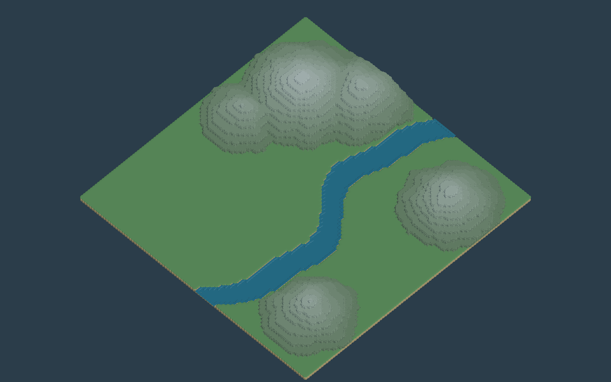

# TileWorldCreator 산·강 맵 적용 및 검증

작성일: 2026-09-17. Unity 6000.3.14f1 / TWC 4.3.5에서 실행했다.

## 적용 결과

`Assets/EternalSteam/Scene/Tests/OpenWorldSandbox.unity`에 적용하고 저장했다. 기존 토대·포탑 프리팹과 UI를 유지했다.



| 항목 | 결과 |
| --- | --- |
| 논리 격자 | 96×96, 셀 2m, Y축 45° 회전 |
| 맵 크기 | 로컬 기준 약 192×192m; 회전된 맵의 월드 경계 상자는 더 큼 |
| 구성 | 강바닥·강둑, 초지, 강, 10단 산지 = 13개 Blueprint/Build 레이어 |
| 산 높이 | 최고 표면 21m, 평지 1m |
| 생성 방식 | 프로젝트 생성 코드로 셀 마스크 구성 → TWC Blueprint 및 TilesBuildLayer 실행 |
| 사용 프리셋 | SandBlocksPreset, GrassTilesPreset, RiverPreset, CliffTilesPreset_A |
| 렌더링 | 프로젝트 소유 URP Lit 재질로 초지·암석·강 색상 지정 |
| 저장 메시 | 330개 클러스터 메시 에셋; 씬 재로드 후 확인 |
| 건설·소환 허용 셀 | 강·산지·외곽을 제외하고 경계 여유를 둔 3,279개 셀 |
| 높이 캐시 | 513×513 TerrainData, TWC 콜라이더에서 130,773개 유효 높이 샘플 |

TWC의 내장 BSP·미로·노이즈 생성기를 이번 맵에 사용한 것은 아니다. `Tools/ApplyTileWorldMountainRiver.cs`가 산 봉우리와 굽이치는 강의 셀 마스크를 정하고, 실제 모서리·연결 타일·클러스터 메시·콜라이더는 TWC가 생성한다. TWC 배포 코드는 수정하지 않았다.

## 현재 사용하는 연결

- **화면·클릭 충돌:** TWC 메시와 MeshCollider. 전용 `TWC Ground` 물리 레이어를 사용한다.
- **기존 Terrain:** 화면 표시와 TerrainCollider를 끈 상태다. 적·카메라의 기존 `Terrain.SampleHeight()`와 월드 범위 조회를 지원하는 정적 높이 캐시로 남겼다. 원본 `TestTerrain.asset`을 덮어쓰지 않았다.
- **토대 설치:** `TileWorldGround.CheckFoundation()`이 8×8m 토대 면적의 81개 지점에서 허용 셀·실제 TWC 콜라이더 높이·높이 차이를 검사한다. 강·산지·외곽에는 설치하지 못한다.
- **포탑:** 토대별 기존 4×4 건설 칸, 예약·점유·확정·취소·회수 로직을 유지한다.
- **적:** 기존 직선 이동을 유지한다. `EnemySpawnStream`이 가까운 토대까지의 경로를 검사하여 강·산지를 가로지르는 소환 후보를 제외한다. 장애물 우회 경로나 강을 건너는 길찾기는 구현하지 않았다.
- **카메라:** WASD·휠 조작 유지. 초기 Zoom 62로 강과 주변 산지가 보이도록 했다. 전체 미리보기는 별도 캡처 카메라로 생성했으며 게임 카메라 설정과 다르다.

## 검증 결과

| 검증 | 결과 | 기록 |
| --- | --- | --- |
| 연동 코드 컴파일 | 오류 없음 | Unity recompile_status completed / failed=false |
| 저장 씬 재로드 | 통과 | 메시 에셋과 TWC 설정·콜라이더 유지 |
| 격자·지형·높이 | 통과 | [twc-editmode.json](twc-editmode.json) |
| 토대와 적 소환·이동 | 통과 | [twc-playmode.json](twc-playmode.json) |
| 현행 건설 UI | 통과 | [twc-construction-ui.json](twc-construction-ui.json) |
| 화면 | 캡처 및 확인 | [Game 카메라](twc-mountain-river-game.png), 위 전체 미리보기 |

Edit 검증: 45°/2m 설정, 330개 메시 영속 저장, 지원되는 재질, 825개 허용 샘플·1,479개 제외 샘플, 산 높이 21m, 평지 높이 캐시 최대 오차 약 0.0003m, 강·산지·맵 외부 설치 차단, 강 횡단 직선 경로 거부를 확인했다.

Play 검증: 평지 토대 생성·조회 후 적 512마리를 소환했다. 이동 함수를 0.1초씩 100회 호출한 **10초 분량 시뮬레이션**에서 남은 473마리의 유효 지면·경로·높이를 검사했다. 검증 후 적과 생성한 토대를 정리했다. 실시간 10초 프레임 성능이나 동시 10만 마리 성능 측정 결과는 아니다.

현행 건설 UI 검증: 토대·포탑 임시 배치, 수정 취소 시 고스트·예약 해제, 재설치·확정, 기존 건물 회수 선택·해제·취소·확정, 토대와 포탑 일괄 회수, 빈 토대 회수를 통과했다. `Tools/VerifyTileWorldConstructionUI.cs`는 기존 현행 UI 검증에서 고정 폭 인벤토리 줄바꿈 검사만 분리한 지형용 회귀 검증이다.

기존 검증 도구의 한계도 구분한다. `VerifyDocumentConstruction`은 폐기된 `foundation` 버튼을 찾아 실패했다. `VerifyBuildingInventoryUI`는 새 맵의 건설·회수 단계까지 통과한 뒤 현재 좁은 Game 뷰에서 고정 폭 8칸 줄바꿈 검사에 실패했다. 해당 UI 레이아웃은 이번 지형 작업에서 변경하지 않았으며, 전체 UI 검증이 통과했다고 간주하지 않는다. 백그라운드 Play가 프레임 2에서 멈춰 지연 삭제 검증이 실패한 첫 시도는 검증 세션에서 `Application.runInBackground=true`로 프레임 진행을 허용한 뒤 다시 수행했다. 프로젝트의 PlayerSettings는 변경하지 않았다.

## 재생성과 복원

- 생성 도구: `Tools/ApplyTileWorldMountainRiver.cs`, 진입점 `ApplyTileWorldMountainRiver.Main`.
- Edit 검증: `Tools/VerifyTileWorldMountainRiver.cs`, 진입점 `VerifyTileWorldMountainRiver.EditMode`.
- Play 검증: 같은 파일의 `VerifyTileWorldMountainRiver.PlayMode`.
- 건설 UI 검증: `Tools/VerifyTileWorldConstructionUI.cs`, 진입점 `VerifyTileWorldConstructionUI.Main`.
- 전체 캡처: `Tools/CaptureTileWorldMap.cs`, 진입점 `CaptureTileWorldMap.Main`.

Unity 프로젝트 폴더에서 다음처럼 실행한다. 여러 프로젝트가 열려 있을 때 잘못된 Editor를 사용하지 않도록 프로젝트 경로를 명시한다.

```sh
unity command run_script --file Tools/ApplyTileWorldMountainRiver.cs --entry ApplyTileWorldMountainRiver.Main --timeout_ms 120000 --timeout 150 --project-path "$PWD"
```

재생성은 Play 종료 상태의 OpenWorldSandbox에서 실행한다. 씬에 사전 배치된 토대가 있으면 자동 삭제하지 않고 중단한다. 새 Generated 폴더를 만들어 설정·높이 캐시·메시·재질을 저장하고 씬을 갱신한다. 반복 실행 시 이전 생성 폴더는 자동 삭제하지 않는다.

현재 생성 에셋: `Assets/EternalSteam/Content/Environments/TileWorldMountainRiver/Generated/`.

원본 백업: `Assets/EternalSteam/Scene/Tests/OpenWorldSandbox_BeforeTileWorld.unity`. 백업 씬을 열면 기존 Terrain 환경을 사용할 수 있다. 완전히 복원하려면 Unity에서 백업을 열고 기존 OpenWorldSandbox 경로에 Save As 한다. 원본 Terrain 에셋과 기존 건물 프리팹은 보존되어 있다.

TWC의 `GenerateCompleteMap()`은 Editor 코루틴을 예약하고 먼저 반환한다. 생성 도구는 모든 레이어의 생성과 후처리 프레임을 기다린 뒤 메시를 저장하고 높이 캐시를 만든다. `OnMapReady`만으로 메시·콜라이더 완성을 판단하지 않는다.

## 남은 범위

- 동적 지형 파괴, 런타임 재생성, 강 건너기·우회 길찾기는 미적용.
- TWC Inspector에서 레이어만 다시 생성하면 전용 재질·높이 캐시·허용 셀까지 자동 갱신되지 않는다. 현재는 전체 생성 도구로 함께 갱신한다.
- 임의의 스케일·회전·원점 변경, 다른 프리셋, Standard Grid, 수상 건설·경사로 건설은 별도 검증이 필요하다.
- 격자 안전 판정은 현재 맵의 정적 마스크와 표본 검사다. 임의의 작은 구멍이나 이후 추가한 동적 장애물 전체에 대한 보장은 아니다.
- 새 맵의 동시 10만 마리 성능·최대 수용량 및 빌드는 이번에 검증하지 않았다. 적 공간이 부족하면 기존대로 대기 요청이 남는다.
- 상세 절벽 타일을 병합해 저장한 생성 폴더는 약 176MB다. 배포용 메시 단순화와 메모리·드로콜 최적화는 후속 작업이다.
