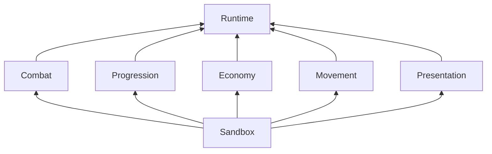

# 개발 모듈 경계

모듈화의 기준은 플레이어의 기능 선택이 아니라 **개발자가 다른 기능의 구현을 수정하지 않고 해당 기능을 교체하고 검증할 수 있는가**다. Inspector 에셋은 구성 지점이며 코드 모듈 경계 자체가 아니다.

## 컴파일 경계

| 어셈블리 | 책임 | 프로젝트 내부 의존성 |
|---|---|---|
| EternalSteam.Runtime | 건물 생명주기, 정의·카탈로그, 배치·회수, 공통 계약 | 없음 |
| EternalSteam.Combat | 공격 선택·실행·효과·내구도, 샘플 대상 레지스트리 | Runtime |
| EternalSteam.Progression | 강화와 넥서스 상태 | Runtime |
| EternalSteam.Economy | 저장·생산·변환과 자원 잔량 | Runtime |
| EternalSteam.Movement | 이동 방벽 등록·조회 | Runtime |
| EternalSteam.Presentation | 건물 외형·범위·공격 표현과 Unity 개체 생성 | Runtime |
| EternalSteam.Sandbox | 검증 씬의 구성, 입력·UI, 테스트 적과 게임 흐름 | Runtime 및 위 구현 어셈블리 |
| EternalSteam.Editor | 에셋 생성과 검사 도구 | Runtime, Sandbox 및 구현 어셈블리 |

기능 어셈블리는 서로를 참조하지 않는다. 공통 Runtime도 기능 어셈블리나 Input System을 참조하지 않는다. `ArchitectureTests.RuntimeAndFeatureAssembliesEnforceOneWayDependencies`가 이 규칙을 검사한다. 개별 asmdef가 컴파일 단계에서도 참조 경계를 강제한다.

## 교체 계약

- **공격 ↔ 성장:** 공격은 `IDamageModifier`의 배율만 읽는다. 강화 모듈 없이 버프·장비·고정 배율 같은 별도 구현으로 대체할 수 있다.
- **성장 ↔ 내구도:** 강화는 `IHealthScaling`에 체력 배율을 전달한다. 구체적인 HealthModule을 참조하지 않는다.
- **성장 ↔ 레벨 제한:** `ILevelLimit`이 최대 허용 레벨과 면제 여부를 제공한다. 기본 구성은 NexusState지만 연구·스테이지 등 다른 정책을 `BuildingServices`의 `levelLimit`에 주입할 수 있다. 이 정책은 넥서스 등록이나 패배 처리를 구현할 필요가 없다.
- **넥서스 ↔ 건물:** `IDamageReceiver`와 `ILevelProvider`를 조회한다. 기본 Health·Upgrade 모듈을 전제로 하지 않는다. 넥서스 역할은 `ILevelAuthority` 능력으로 표현한다.
- **게임 흐름 ↔ 패배 조건:** SandboxSession은 `IDefeatCondition`만 구독한다. 넥서스 외의 패배 조건 구현으로 교체할 수 있다.
- **방향 ↔ 공격:** BuildingInstance는 `DirectionChanged`만 발행한다. 공격 모듈이 구독해 타겟을 해제하고 종료 시 구독을 해제한다. 건물 본체는 공격 클래스를 모른다.
- **표현·입력 ↔ 기능:** `IAttackControl`, `IUpgradeControl`, `IDamageReceiver`를 사용한다. 생성·서비스 연결을 담당하는 FoundationSandbox에서만 구체 구현을 선택한다.
- **자원·이동 서비스:** `IResourceBank`, `IMovementObstacles`를 주입한다. 모듈 내부에서 전역 서비스를 검색하지 않는다.

에셋 조합 검사는 `BuildingModuleDefinition.Provides(Type)`와 `BuildingDefinition.Provides<T>()`로 필요한 능력을 확인한다. 새로운 내구도 구현은 런타임에서 IDamageReceiver를 구현하고 정의에서 같은 능력을 선언해야 한다. 검사를 위해 개체를 생성하거나 구체 HealthModuleDefinition 타입을 요구하지 않는다.

공통 계약은 `Code/Contracts`에 둔다. 새 기능은 우선 자신의 어셈블리 안에서 구현한다. 다른 기능과 실제로 공유할 필요가 확인된 최소 계약만 공통 위치에 추가한다. 범용 서비스 탐색기·범용 이벤트 버스·기능마다 빈 인터페이스를 추가하지 않는다.

## 검증과 범위

공격에 독립 피해 배율 구현을 주입하고, 강화에 독립 레벨 제한·체력 구현을 연결하며, 넥서스에 대체 내구도 모듈을 연결하는 테스트를 추가했다. 기존 검증 씬·에셋·카탈로그 구성은 유지한다. 새 모듈과 테스트를 포함한 최신 결과는 `Validation/개발_모듈_경계_검증.md`에 기록한다.

이 변경은 **새 공통 기반의 개발 의존성 분리**다. 기존 LegacyDemo에서는 입력·카메라·배치 편집·미리보기를 별도 어셈블리로 분리했다. [레거시 배치 분리](레거시_배치_분리.md)를 참고한다. 기존 배치는 [공통 건물 월드에 연결](레거시_공통_건물_연결.md)했으며, [전투·적 관리도 분리](레거시_전투_분리.md)했다. LegacyCombat은 LegacyDefinitions만 참조하고, LegacyBuildings·LegacyPresentation이 이를 사용한다. [Editor 실제 프레임 CPU·GC 측정](Validation/Editor_프레임_측정.md)을 완료했으며 빌드는 사용자 지시로 제외했다. 소스 폴더를 지우면 Sandbox·Editor·Tests 구성 참조도 정리해야 하므로, 단순 폴더 삭제를 기능 제거 방법으로 보장하지 않는다.
