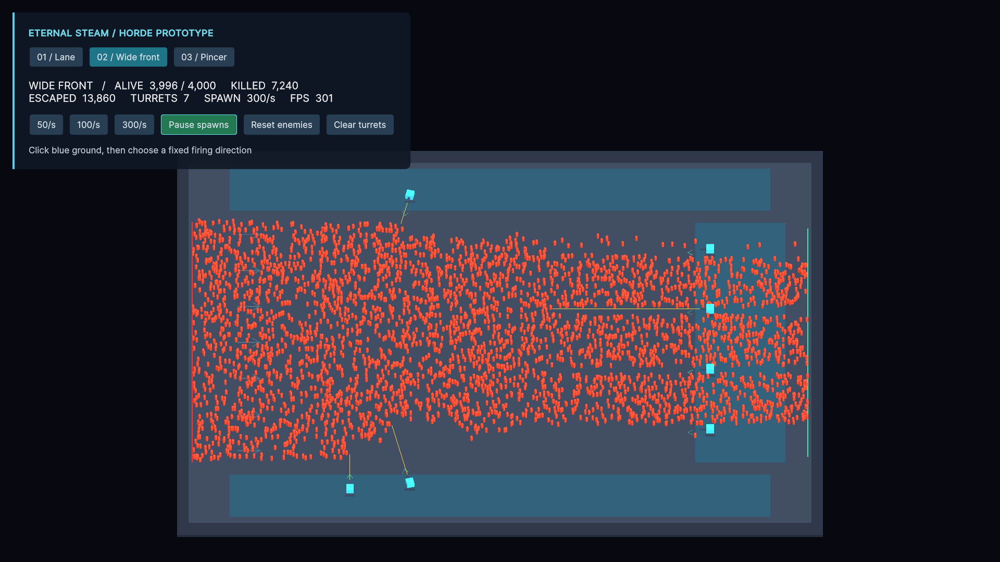

> 클리어 판정: 처치한 적과 출구를 통과한 적을 합쳐 처리 수로 계산합니다. 모든 적이 처리되고 체력이 남아 있으면 클리어입니다. 체력 0은 패배가 우선합니다. 통과한 적은 기존처럼 체력을 1씩 깎습니다.

> 최신 변경: 적 수는 1,500 / 3,000 / 5,000마리입니다. 포탑은 종류별 기본 4개(기본 배치 포함), 로비에서 부품으로 1개씩 늘려 최대 16개까지 설치할 수 있습니다. 첫 강화 비용 100, 같은 종류를 강화할 때마다 50씩 증가합니다. 기존 부품·클리어 기록은 유지되며 설치 한도도 저장됩니다. 철거하면 설치 가능 수가 돌아옵니다. 공격력·기지 강화는 아직 없습니다. 검증 도구: `Tools/VerifyCapacityUpgrade.cs`.

# Eternal Steam

3D 도형으로 적 물량과 포탑 자동 공격을 확인하는 Unity 프로토타입입니다.

## 다운로드 및 실행

1. 저장소를 복제하거나 GitHub의 **Code → Download ZIP**으로 다운로드한 뒤 압축을 풉니다.
   ```sh
   git clone https://github.com/imset3/Eternal_Steam.git
   ```
2. Unity Hub에서 **Unity 6000.3.14f1**을 설치합니다.
3. Unity Hub의 **Add**로 `Assets`, `Packages`, `ProjectSettings`가 있는 저장소 루트를 등록합니다.
4. 프로젝트를 열고 최초 패키지 다운로드와 임포트가 끝날 때까지 기다립니다.
5. `Assets/EternalSteam/Scene/Demo/HordeDemo.unity`를 열고 **Play**를 누릅니다.

처음에는 로비로 시작합니다. 맵과 해금된 스테이지를 선택하면 적 없이 설치 단계로 이동합니다. 파란 구역을 클릭해 위치를 잡고, 마우스로 사격 방향과 거리를 정한 뒤 다시 클릭하면 포탑이 설치됩니다. 가까운 설정은 넓게, 먼 설정은 좁게 탄이 퍼집니다. 우클릭 또는 Esc로 취소할 수 있습니다. 포탑은 설치 방향을 유지하며 전투 시작 후 적 유무와 관계없이 기관총처럼 한 발씩 연사합니다.

설치를 마치고 **전투 시작**를 누르면 적이 생성됩니다. HUD에서 생성 속도를 초당 50/100/300마리로 조절할 수 있습니다. **재도전**는 설치한 포탑을 유지하고 적을 지운 뒤 설치 단계로 돌아갑니다.

## 맵

왼쪽 UI의 전장 선택 버튼으로 맵을 전환합니다. 전환하면 해당 맵의 기본 포탑과 로비로 시작합니다.

| 맵 | 씬 | 구성 |
| --- | --- | --- |
| 01 / Lane | `HordeDemo.unity` | 기존 54×26 통로, 기본 포탑 4개 |
| 02 / Wide front | `HordeWideFront.unity` | 86×64 평원, 40 유닛 폭의 정면에서 진격, 기본 포탑 6개 |
| 03 / Pincer | `HordePincer.unity` | 86×64 협공 전장, 위아래에서 합류하는 적 무리, 기본 포탑 6개 |

모든 씬은 `Assets/EternalSteam/Scene/Demo/`에 있습니다. 추가 맵은 초당 300마리 설정으로 시작 버튼을 기다립니다.

동시 적 최대 4,000마리, 포탑 최대 64개입니다. 기관총(단일 연사), 포(범위 처치), 냉각 포탑(이동 감속)을 선택해 배치할 수 있습니다. 플레이어 체력은 1,000이며, 적이 출구를 통과할 때마다 1씩 감소합니다. 체력이 0이면 전투가 멈추고 **재도전**로 배치를 유지한 채 다시 준비할 수 있습니다. 로컬 재화와 클리어 기록을 저장합니다. 기지 레벨·포탑 공격력 강화와 적끼리의 물리 충돌은 아직 구현하지 않습니다.



## 문서

- [상세 조작법 및 검증 안내](Docs/데모_실행_안내.md)
- [레퍼런스 분석 및 데모 설계](Docs/이터널스팀_레퍼런스_분석_및_데모_설계.md)
- [HTML 설계 문서](Docs/이터널스팀_레퍼런스_분석_및_데모_설계.html): 다운로드한 파일을 웹 브라우저에서 열면 됩니다.

설계 문서는 후속 확장 아이디어를 포함합니다. 현재 구현 범위는 이 README와 실행 안내를 기준으로 합니다.

## 개발

URP와 Input System을 사용하며 패키지 버전은 `Packages/manifest.json`과 `packages-lock.json`으로 관리합니다. 일반적인 에디터 실행에는 Unity CLI가 필요하지 않습니다. CLI로 작업할 때는 프로젝트의 Unity Pipeline 패키지를 이용합니다.

`Tools/`에는 씬 생성 및 Play 중 검증용 CLI 스크립트가 있습니다. 검증은 현재 플레이 상태를 초기화하므로 실행 안내를 확인한 뒤 사용하세요.

`Library`, `Temp`, `Logs`, `UserSettings` 등 자동 생성 파일은 Git에서 제외됩니다. 에셋을 추가할 때는 대응하는 `.meta` 파일도 함께 커밋하세요.

## 스테이지 클리어

각 맵에서 1,500 → 3,000 → 5,000마리의 3개 스테이지를 진행합니다. 수량은 데모용 임시 값이며 HordeSimulation의 StageCounts에서 변경할 수 있습니다. 생성 속도를 바꿔도 총수량은 유지됩니다. 처치와 통과를 합쳐 모든 적이 처리되고 체력이 남아 있으면 클리어됩니다. 체력 0이면 즉시 패배합니다.

다음 단계는 포탑을 유지하고 체력을 회복한 다음 스테이지 설치 단계로 이동합니다. 전투 시작를 눌러야 다음 전투가 시작됩니다. 재도전는 현재 스테이지를 다시 준비하며, 마지막 클리어 후 처음부터은 1스테이지로 돌아갑니다. 맵을 변경하면 해당 맵의 1스테이지부터 시작합니다.

검증: Tools/VerifyStages.cs에서 고정 수량 제한, 마지막 적 처치 판정, 다음 스테이지 준비, 포탑 유지, 최종 클리어와 재시작, 통과 적 처리 및 재도전을 검사합니다. 기존 무한 생성 기준의 4,000마리 부하 검증 스크립트는 현재 스테이지 수량 제한과 호환되지 않습니다.

## 로비·재화 프로토타입

로비 → 스테이지 선택 → 설치 → 전투 시작 → 모든 적 처리 → 보상 확인 → 다음 단계 또는 로비로 순서로 진행합니다. 각 맵의 1스테이지부터 순서대로 해금되며, 이미 깬 스테이지도 다시 플레이할 수 있습니다. 같은 맵에서 로비로 돌아가도 포탑 배치는 유지되고, 다른 맵으로 바꾸면 기본 배치로 시작합니다. 배치는 영구 저장하지 않습니다.

관통 화살은 화살 버튼으로 설치합니다. 초록색 사선에 있는 여러 적에게 한 발당 20 피해를 줍니다. 프로토타입이라 움직이는 탄환 대신 즉시 사선 판정을 사용합니다. 적 체력은 20, 총 피해는 10, 대포 피해는 20이며 냉각은 기존 감속을 유지합니다. 모델은 도형 그대로입니다.

반복 클리어 보상은 스테이지 1/2/3에 부품 100/200/300이며, 최초 클리어에는 같은 양을 추가 지급합니다. 실패·중도 이탈에는 보상이 없습니다. 재화와 맵별 클리어 기록은 PlayerPrefs의 EternalSteam.Prototype.Progress.v1 한 항목에 JSON으로 함께 저장합니다. 보상 결과는 한 번만 지급합니다. 기지는 1레벨 표시만 있고, 부품으로 종류별 포탑 설치 한도를 강화할 수 있습니다. 공격력·기지 레벨 강화는 후속 작업입니다. 온라인 저장·전투 중 저장은 없습니다.

검증: Tools/VerifyPrototypeLoop.cs와 Tools/VerifyStages.cs를 Play 모드에서 Unity CLI run_script로 실행합니다. 테스트는 별도 임시 저장 키를 사용하고 종료 시 삭제합니다. 검증 후 게임은 로비로 돌아갑니다. 기존 즉사 공격·로비 없는 흐름을 전제한 예전 검증 도구는 현재 기능 검증에 사용하지 않습니다.


## 프로젝트 전체 구성 보고서

> 작성일: 2026-09-14 · 현재 저장소의 코드·설정 파일 기준. 수치는 프로토타입용이며, 기획 문서의 후속 제안과 현재 구현을 구분합니다. 이번 보고서 작성에서는 코드 실행이나 성능 측정을 새로 수행하지 않았습니다.

### 1. 목적과 실행 환경

이 프로젝트는 **포탑을 배치하고 몰려오는 적을 처리하는 재미**와 **클리어 보상으로 설치 수를 늘리는 반복 플레이**를 확인하는 3D 디펜스 프로토타입입니다. 모델은 기본 도형, 공격 연출은 선과 범위 표시를 사용합니다.

| 항목 | 현재 구성 |
| --- | --- |
| Unity | 6000.3.14f1 |
| 렌더링 | Universal RP 17.3.0 |
| 입력 | Input System 1.19.0, 마우스·키보드 |
| UI | UI Toolkit, UXML·USS·C# |
| 한글 | 프로젝트에 포함한 Noto Sans CJK KR와 OFL 라이선스 |
| 개발 자동화 | Unity Pipeline 0.6.0-exp.1 및 Unity CLI |
| 테스트 패키지 | Unity Test Framework 1.6.0 |
| 배포 형태 | Unity 프로젝트 소스, 실행 파일 배포는 별도 작업 |

AI Navigation·Timeline·Multiplayer Center 등도 패키지 목록에 있지만, 현재 데모에 길 찾기·타임라인 연출·멀티플레이가 구현되어 있다는 뜻은 아닙니다. 일반 플레이에는 Unity CLI가 필요하지 않습니다.

### 2. 저장소 폴더 구성

아래 경로는 Git 저장소 루트 기준입니다. `Assets`, `Packages`, `ProjectSettings`가 있는 폴더를 Unity Hub에 등록합니다.

```text
Assets/
├─ EternalSteam/
│  ├─ Scene/          # Demo, Tests: 모든 관리 대상 씬
│  ├─ Code/           # Building, Placement, Combat, LegacyDemo, Editor
│  ├─ Content/        # Buildings, Enemies, Environments
│  ├─ Shared/         # Fonts, Materials, UI
│  ├─ Settings/       # Rendering, Input, UI, Catalogs
│  └─ Tests/          # EditMode, PlayMode, Sandbox, Templates
└─ _Recovery/         # 사용자 로컬 복구 자료: 자동 이전 대상에서 제외
Packages/
ProjectSettings/
Tools/                # CLI 생성·검증 도구
Docs/                 # 기획·사용법·검증 결과
README.md
```

`Library`, `Temp`, `Logs`, `UserSettings`는 로컬 자동 생성 파일입니다. `Assets/_Recovery`는 로컬 복구 파일로 이번 보고서 업로드에 포함하지 않습니다. Git에 등록하는 에셋은 대응하는 `.meta` 파일도 함께 관리합니다.

### 3. 씬과 화면 흐름

| 씬 | 화면 이름 | 전장 크기 | 기본 포탑 |
| --- | --- | --- | --- |
| `HordeDemo.unity` | 통로 | 54 × 26 | 4개 |
| `HordeWideFront.unity` | 넓은 전선 | 86 × 64 | 6개 |
| `HordePincer.unity` | 협공 | 86 × 64 | 6개 |

세 데모 씬은 `Assets/EternalSteam/Scene/Demo/`에 있습니다. 빌드 설정에는 이 세 씬과 템플릿 `SampleScene`이 등록되어 있으며, 첫 번째는 `HordeDemo`입니다. 게임 내 전장 선택은 세 데모 씬만 사용합니다.

로비·준비·전투·결과는 별도 씬이 아니라 **각 전장 안에서 상태와 UI를 전환**하는 구조입니다.

1. **로비:** 전장 선택, 해금된 스테이지 출격, 부품과 설치 한도 강화.
2. **준비:** 포탑 종류 선택 → 바닥 클릭으로 위치 고정 → 방향·거리 설정 → 두 번째 클릭으로 확정.
3. **전투:** 전투 시작 버튼을 누르면 적 생성과 자동 공격 시작. 설치·철거 금지.
4. **결과:** 클리어 시 부품 지급과 다음 단계 해금. 다음 단계, 재도전, 로비 복귀를 선택.

준비·결과 화면은 왼쪽 UI와 오른쪽 전장을 분리합니다. 전투 중에는 메뉴를 숨기고 전장을 전체 화면으로 확장하며, 상단 중앙에 체력 바와 숫자만 표시합니다. 체력이 25% 이하이면 빨간색으로 바뀝니다. 긴 준비 메뉴는 스크롤되고, 로비/준비 전환과 전투 종료 시 스크롤을 맨 위로 돌립니다.

### 4. 주요 코드의 역할

| 파일 | 역할과 연결 |
| --- | --- |
| [HordeSimulation.cs](Assets/EternalSteam/Code/LegacyDemo/HordeSimulation.cs) | 적 생성·이동·체력·공격·설치·스테이지 판정·카메라를 관리하는 중심 컴포넌트. 결과 확정 시 `HordeProgress`에 보상 요청 |
| [HordeMapLayout.cs](Assets/EternalSteam/Code/LegacyDemo/HordeMapLayout.cs) | 맵 크기, 설치 구역, 출발·도착 경로, 기본 포탑 위치, 그리드 스냅 정의 |
| [HordeBuildGrid.cs](Assets/EternalSteam/Code/LegacyDemo/HordeBuildGrid.cs) | 배치 구역의 그리드 표시용 메시 생성 |
| [HordeTowerKind.cs](Assets/EternalSteam/Code/LegacyDemo/HordeTowerKind.cs) | 4종 포탑 식별자와 피해량·발사 간격·색상·한글 설명 |
| [HordeProgress.cs](Assets/EternalSteam/Code/LegacyDemo/HordeProgress.cs) | 부품, 맵별 클리어 기록, 설치 한도 강화, 보상과 로컬 저장 |
| [HordeHud.cs](Assets/EternalSteam/Code/LegacyDemo/UI/HordeHud.cs) | 버튼 이벤트, 전투 상태 표시, 한도 구매, UI 숨김·복원과 카메라 영역 연결 |
| [HordeHud.uxml](Assets/EternalSteam/Shared/UI/Demo/HordeHud.uxml) | 로비·준비·결과 메뉴와 전투 전용 체력 바의 요소 구조 |
| [HordeHud.uss](Assets/EternalSteam/Shared/UI/Demo/HordeHud.uss) | 한글 글꼴, 색상, 크기, 구역 간격, 스크롤, 표시 상태 |
| `HordePanelSettings.asset` | 런타임 UI 패널 설정 |

버튼 입력은 `HordeHud → HordeSimulation`으로 전달됩니다. 전투는 `HordeMapLayout`과 `HordeTowerStats`의 값을 사용하며, 클리어·구매 결과는 `HordeProgress → PlayerPrefs`에 저장합니다. HUD는 이 상태를 읽어 화면에 표시합니다. 프로토타입이므로 전투 로직은 중심 컴포넌트에 모여 있으며, 별도 서버나 복잡한 서비스 계층은 없습니다.

### 5. 적·스테이지·클리어 규칙

| 항목 | 현재 값 또는 동작 |
| --- | --- |
| 스테이지 수 | 각 맵에서 3단계 |
| 총 적 수 | 1단계 1,500 / 2단계 3,000 / 3단계 5,000 |
| 동시 적 상한 | 4,000. 빈 슬롯이 생기면 남은 생성 수량을 이어서 처리 |
| 적 체력 | 20 |
| 출현 속도 선택 | 준비 화면에서 초당 50 / 100 / 300마리 |
| 플레이어 체력 | 최대 1,000 |
| 적 통과 | 체력 1 감소, 해당 적은 전장에서 제거하고 처리 완료에 포함 |
| 클리어 | 처치 수 + 통과 수 = 스테이지 총수, 생존 적 0, 플레이어 체력 > 0 |
| 패배 | 체력 0. 마지막 적 처리와 겹쳐도 패배 우선 |
| 다음 단계·재도전 | 배치 유지, 적·단계 카운터 초기화, 체력 회복, 수동 시작 대기 |

적은 구조체 배열과 재사용 슬롯으로 관리합니다. 주변 공격 대상 조회에는 공간 격자를 사용하고, 적은 메시 인스턴싱으로 렌더링합니다. 화살 관통은 적 배열을 순회하는 단순 사선 판정입니다. 적끼리 밀거나 충돌하지 않고 지정된 도착점으로 직선 이동합니다. 에디터 프레임 수는 성능 보장 수치가 아닙니다.

### 6. 포탑과 설치 규칙

| 포탑 | 피해 | 공격 간격 | 역할 |
| --- | --- | --- | --- |
| 기관총 | 10 | 0.055초 | 사선의 가장 가까운 적 하나에게 연사 |
| 대포 | 20 | 0.7초 | 피격점 또는 사거리 끝을 중심으로 반경 3의 범위 공격 |
| 냉각 | 0 | 0.18초 | 방향 부채꼴 안의 적에게 2.5초간 60% 감속을 반복 적용 |
| 관통 화살 | 20 | 0.35초 | 사선에 있는 여러 적에게 한 발당 한 번씩 피해 |

모든 포탑은 배치 때 정한 방향을 유지하며 적을 따라 회전하지 않습니다. 전투 중에는 적 유무와 관계없이 발사합니다. 사거리는 6~26유닛이며, 가까이 설정할수록 넓게 퍼지고 멀리 설정할수록 좁게 모입니다. 화살은 실제 이동 탄환이 아닌 즉시 사선 판정입니다.

설치 그리드는 2×2유닛이고 포탑은 종류와 관계없이 한 칸을 점유합니다. 같은 칸 중복과 바닥 밖 배치를 막으며, 인접한 빈 칸은 사용 가능합니다. 첫 클릭 전에는 포탑 미리보기, 첫 클릭 후에는 방향·거리 안내가 나타납니다. 설치가 끝난 포탑의 범위는 준비 단계에 계속 표시됩니다. 전투 중에는 추가 설치와 전체 철거가 차단됩니다.

### 7. 부품·설치 한도·저장

- 스테이지 반복 보상은 **100 / 200 / 300부품**이며, 최초 클리어에는 같은 양을 추가 지급합니다.
- 실패와 중도 복귀에는 보상이 없습니다. 부품은 모든 맵에서 공유합니다.
- 포탑은 **종류별 기본 4개 → 최대 16개**까지 설치할 수 있고 기본 배치도 포함됩니다. 전체 상한은 64개입니다.
- 로비에서 종류별 한도를 1개씩 구매합니다. 비용은 `100 + 해당 종류의 구매 횟수 × 50`이며, 최대 도달 또는 부품 부족이면 구매되지 않습니다.
- 한도 구매는 영구 진행에 저장되지만 실제 포탑 위치·방향은 저장하지 않습니다. 같은 씬에서 로비 복귀 시 배치는 유지되고, 전장 전환 시 기본 배치로 시작합니다.

저장은 `PlayerPrefs`의 `EternalSteam.Prototype.Progress.v1` 키에 JSON 한 항목으로 기록합니다.

| 저장 필드 | 내용 |
| --- | --- |
| `parts` | 보유 부품 |
| `cleared[3]` | 각 맵에서 클리어한 최고 단계. 다음 단계 해금과 최초 보상 판정에 사용 |
| `capacityUpgrades[4]` | 기관총·대포·냉각·화살 순서의 한도 구매 횟수 |
| `lastReward` | 마지막 보상 지급 전투 식별자 |

전투마다 식별자를 만들고 결과 확정 여부를 기록해 같은 결과를 반복 지급하지 않도록 합니다. 계정 인증·클라우드 동기화·저장 암호화·전투 도중 이어하기는 없습니다. 로컬 저장 데이터는 Git에 포함되지 않으므로 팀원은 각자 새 진행으로 시작합니다.

### 8. 개발·검증 도구

`Tools/`는 런타임 게임 코드가 아니라 Unity CLI에서 실행하는 생성·진단용 C#입니다. CLI 실행에는 해당 프로젝트의 Editor 연결이 필요합니다.

| 도구 | 검사 또는 작업 범위 |
| --- | --- |
| `CreateHordeDemo.cs`, `CreateHordeMaps.cs` | 최초 데모 씬 생성. 기존 씬 덮어쓰기 방지 |
| `VerifyStages.cs` | 단계별 총수량, 마지막 적 처리, 통과 포함 클리어, 다음 단계·재도전 |
| `VerifyCapacityUpgrade.cs` | 종류별 한도, 비용·최대치, 저장 복원, 전투 중 구매 차단, 5,000마리 슬롯 재사용 |
| `VerifyPrototypeLoop.cs` | 로비·출격 버튼, 적 체력, 화살 관통, 보상·저장·해금 |
| `VerifyBuildSurfaces.cs`, `VerifyGridOccupancy.cs` | 바닥 지지와 그리드·중복 점유 검사 도구 |
| `VerifyAutomaticFire.cs`, `VerifyDirectionalHorde.cs`, `VerifyTowerRoles.cs` | 자동 발사·방향·포탑 역할 개발 당시의 검증 도구 |
| `VerifyHordeDemo.cs`, `VerifyHordeHud.cs`, `ProbeHordeFlow.cs` | 초기 데모·HUD·씬 전환 진단 도구 |

일부 이전 도구는 무한 생성, 한 번에 처치, 로비 없는 흐름 또는 설치 한도 없는 상태를 전제로 합니다. 현재 규칙에 맞게 조정되지 않은 도구를 전체 회귀 테스트로 간주하면 안 됩니다. 이번 보고서 작성은 소스 검토이며, 모든 도구가 최신 코드에서 통과한다는 인증이 아닙니다. 검증 실행은 현재 플레이 상태를 바꿀 수 있습니다.

```sh
# 저장소 루트에서, Unity Editor의 Play 모드 중 실행
unity command run_script --file Tools/VerifyStages.cs --entry VerifyStages.Main --project-path . --format json
unity command run_script --file Tools/VerifyCapacityUpgrade.cs --entry VerifyCapacityUpgrade.Main --project-path . --format json
```

### 9. 팀원이 수정할 위치와 현재 한계

| 변경할 내용 | 우선 확인할 위치 |
| --- | --- |
| 적 수·체력·전투 판정 | `HordeSimulation.cs`의 `StageCounts`, `Spawn`, `StageCleared` |
| 맵 크기·설치 구역·진격 경로 | `HordeMapLayout.cs`와 해당 씬. 씬 바닥 수정도 함께 확인 |
| 포탑 피해·발사 간격 | `HordeTowerKind.cs`의 `HordeTowerStats` |
| 부품 보상·한도·강화 비용 | `HordeProgress.cs` |
| 문구·버튼 동작·화면 전환 | `HordeHud.cs`, `HordeHud.uxml` |
| 글꼴·간격·색상·크기 | `HordeHud.uss`, `UI/Fonts/` |

현재 강화는 **포탑 설치 개수 증가만** 구현되어 있습니다. 기지 레벨 상승, 공격력 강화, 특수 스킬트리, 신규 포탑 해금은 아직 없습니다. 정식 모델·투사체 애니메이션·고급 VFX·사운드·네트워크 플레이도 후속 범위입니다. 별도 로비 씬 분리나 대규모 구조 변경 없이, 현재 전투와 보상 반복을 검증하는 수준을 유지합니다.

[로비·재화·성장 개발 계획](Docs/로비_재화_성장_개발계획.md)은 아이디어와 후속 범위를 포함합니다. 현재 구현 여부와 수치는 위 구성 보고서 및 실제 코드가 기준입니다.


## 모듈식 공통 기반 (1단계)

`Assets/EternalSteam/Scene/Tests/FoundationSandbox.unity`를 열고 Play하면 별도 검증 씬을 실행합니다. 카탈로그에서 건물을 선택하고 설치 → 격자 클릭(복수 가능) → 확정으로 배치합니다. 건물을 선택해 공격 방향과 지상·공중 필터를 변경할 수 있습니다. 회수는 선택 후 일괄 확정합니다. 기존 `HordeDemo` 세 맵과 저장 규칙은 유지합니다.

건물은 `BuildingDefinition`과 선택적인 체력·공격 모듈 에셋으로 조합합니다. 새 정의를 `SampleCatalog`에 등록하면 UI 목록에 자동 반영됩니다. 상세 계약과 테스트는 [공통 기반 개발 안내](Docs/공통_기반_개발_안내.md)를 참고하세요.

폴더 배치 기준은 [폴더 구조](Docs/폴더_구조.md)를 참고하세요.
