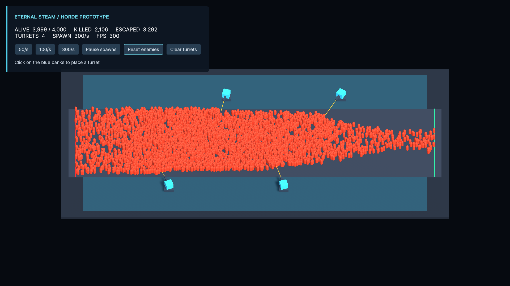

# Eternal Steam

3D 도형으로 적 물량과 포탑 자동 공격을 확인하는 Unity 프로토타입입니다.

## 다운로드 및 실행

1. 저장소를 복제하거나 GitHub의 **Code → Download ZIP**으로 다운로드한 뒤 압축을 풉니다.
   ```sh
   git clone https://github.com/imset3/Eternal_Steam.git
   ```
2. Unity Hub에서 **Unity 6000.3.14f1**을 설치합니다.
3. Unity Hub의 **Add**로 `Assets`, `Packages`, `ProjectSettings`가 있는 저장소 루트를 등록합니다.
4. 프로젝트를 열고 최초 패키지 다운로드와 임포트가 끝날 때까지 기다립니다.
5. `Assets/HordeDemo/Scenes/HordeDemo.unity`를 열고 **Play**를 누릅니다.

처음에는 포탑 4개가 배치됩니다. 파란 구역을 클릭하면 포탑을 추가하며, 포탑은 근처 적을 자동으로 공격합니다. HUD에서 적 생성 속도를 초당 50/100/300마리로 조절할 수 있습니다.

동시 적 최대 4,000마리, 포탑 최대 64개입니다. 경제·강화·승패 시스템과 적끼리의 물리 충돌은 구현 범위에 포함하지 않습니다.



## 문서

- [상세 조작법 및 검증 안내](Docs/데모_실행_안내.md)
- [레퍼런스 분석 및 데모 설계](Docs/이터널스팀_레퍼런스_분석_및_데모_설계.md)
- [HTML 설계 문서](Docs/이터널스팀_레퍼런스_분석_및_데모_설계.html): 다운로드한 파일을 웹 브라우저에서 열면 됩니다.

설계 문서는 후속 확장 아이디어를 포함합니다. 현재 구현 범위는 이 README와 실행 안내를 기준으로 합니다.

## 개발

URP와 Input System을 사용하며 패키지 버전은 `Packages/manifest.json`과 `packages-lock.json`으로 관리합니다. 일반적인 에디터 실행에는 Unity CLI가 필요하지 않습니다. CLI로 작업할 때는 프로젝트의 Unity Pipeline 패키지를 이용합니다.

`Tools/`에는 씬 생성 및 Play 중 검증용 CLI 스크립트가 있습니다. 검증은 현재 플레이 상태를 초기화하므로 실행 안내를 확인한 뒤 사용하세요.

`Library`, `Temp`, `Logs`, `UserSettings` 등 자동 생성 파일은 Git에서 제외됩니다. 에셋을 추가할 때는 대응하는 `.meta` 파일도 함께 커밋하세요.
